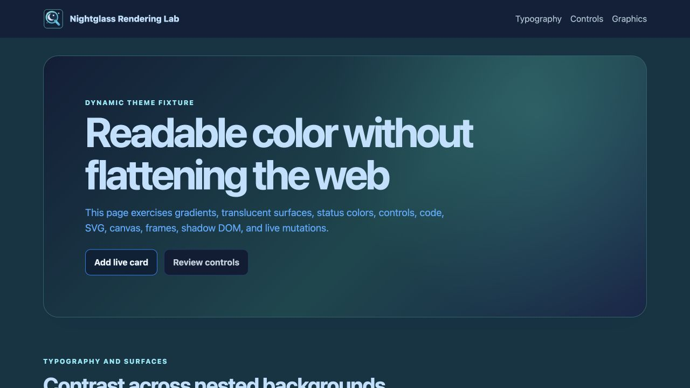
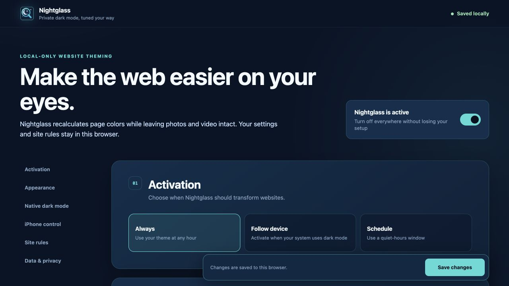
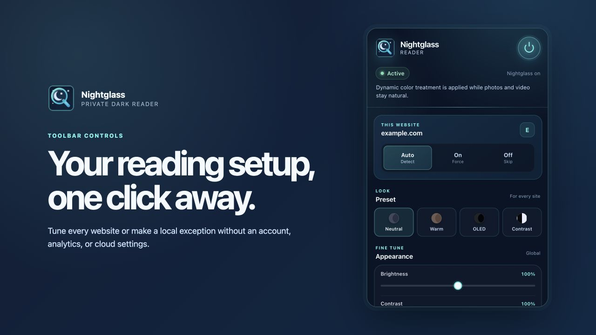

# Nightglass

[](https://github.com/itworksinprod/nightglass/actions/workflows/ci.yml)
[](https://github.com/itworksinprod/nightglass/releases/latest)

**A privacy-first, local-only dynamic dark reader for Chromium, Firefox, Safari,
and an iPhone Safari userscript.**

[Download v0.1.1](https://github.com/itworksinprod/nightglass/releases/tag/v0.1.1) ·
[Privacy boundary](docs/PRIVACY.md) ·
[Threat model](docs/THREAT_MODEL.md) ·
[Architecture](docs/ARCHITECTURE.md)



Nightglass recalculates page colors instead of applying a global inversion
filter, preserving photos and video while transforming backgrounds, gradients,
controls, SVGs, shadow DOM, and dynamically inserted content.

## Product views

| Local settings | Toolbar controls |
| --- | --- |
|  |  |

## Privacy and security boundary

Nightglass has no account, server, analytics, ads, telemetry, remote
configuration, or remote code. Settings stay in local browser storage; the
iPhone userscript uses the userscript manager's local value storage. Production
builds enforce a strict Content Security Policy, pinned dependency hashes,
versioned settings validation, bounded resource retrieval, and deterministic
packaging. See the documented [privacy audit](docs/PRIVACY_AUDIT.md).

## What Nightglass builds

Nightglass integrates the pinned, MIT-licensed Dark Reader rendering engine.
The project owns activation rules, native-dark detection, privacy controls,
presets, per-site settings, browser adapters, user interfaces, packaging, and
automated verification. This distinction is also documented in
[`NOTICE.md`](NOTICE.md) and the [architecture](docs/ARCHITECTURE.md).

## Build targets

The project produces:

- an unpacked Manifest V3 extension for Chrome and Edge;
- a Firefox Manifest V3 build;
- Safari Web Extension resources ready for Apple's packager;
- a self-contained userscript for iPhone Safari through the free, open-source
  Userscripts app.

## Development

```sh
npm run verify
```

Generated browser builds are written to `dist/`. Install and platform-specific
instructions are generated into `dist/INSTALL.md`.

## Project status

Version 0.1.1 is packaged for personal use. Automated tests, build-policy
validation, and archive checks cover every target. Real packaged-extension smoke
tests have passed in Chrome 148, Firefox 154.0.1, and Safari 26.6.2. Safari checks
covered live page transformation, dynamically inserted content, native-dark
preservation, the toolbar popup, settings, and all-website access on HTTPS. The
userscript has also been exercised with an iPhone-sized browser viewport;
installation on a physical iPhone remains a device-side check. See
`docs/ARCHITECTURE.md` for design boundaries and known platform limitations.
